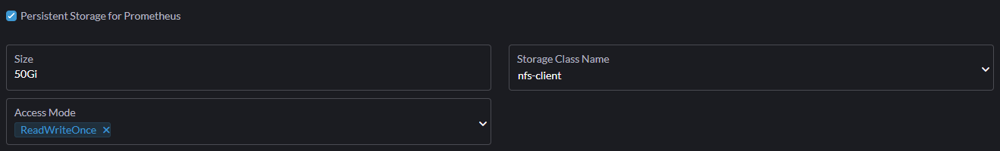
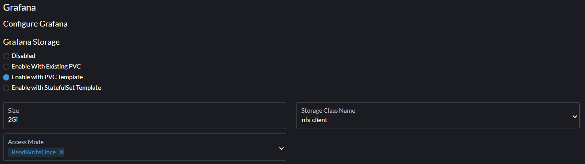

# Navodila za postavitev Monitoring na rancher:

## Potrebno je nastaviti ingress v yaml:
```yaml
  ingress:
    annotations: {}
    enabled: true
    hosts:
      - monitoring.rancher.test
    labels: {}
    path: /
    tls: []
```

(Ne pozabit dodat url v hosts datoteko)

## Potrebno je nastaviti pvc za prometheus

### Lahko se nastavi v yaml
```yaml
prometheus:
  prometheusSpec:
    storageSpec:
      volumeClaimTemplate:
        spec:
          accessModes:
            - ReadWriteOnce
          resources:
            requests:
              storage: 50Gi
          storageClassName: nfs-client
```

### Lahko se ga nastavi tudi v GUI



## Potrebno je nastaviti pvc za grafano

### Lahko se nastavi v yaml:
```yaml
grafana:
  persistence:
    accessModes:
      - ReadWriteOnce
    storageClassName: nfs-client
    size: 2Gi
    subPath: null
    type: pvc
    annotations: null
    finalizers: null
    enabled: true
```
### Lahko se nastavi tudi v GUI

(Enkrat ni delovalo iz neznanega razloga potem je pa delovalo, če ne deluje se da samo upgrade pa ponovno zbere)
